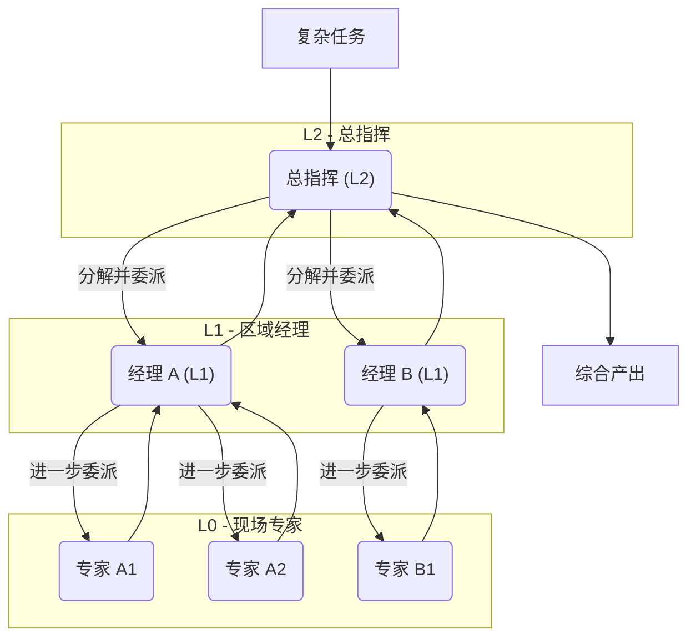

# HiveMind 🐝

[](https://opensource.org/licenses/Apache-2.0)
[](https://www.python.org/downloads/)
[Read this document in English](./README_EN.md)

**HiveMind: 一个为复杂任务而生的、具备层级协作能力的多智能体框架。**

当单个智能体在复杂问题面前束手无策时，HiveMind 允许您构建、编排并扩展一个由 AI 智能体组成的、能够动态组织的“专家团队”。

---

## 🌟 核心愿景：构建智能体之树 (Tree of Agents)

HiveMind 的核心思想是**用组织的力量战胜复杂性**。我们不追求创造一个无所不能的“超级智能体”，而是构建一个结构化的、可预测的、能够分层协作的智能体团队。

这个团队的形态就是一棵**智能体之樹 (ToA)**：

*   **树根 (Root)**：一个高阶智能体接收初始任务。
*   **树枝 (Branches)**：它将任务分解，并动态地创建“子智能体”或“子团队”来处理更具体的子任务。
*   **树叶 (Leaves)**：底层的执行者智能体专注于解决单一、明确的问题。

这个过程可以无限递归，形成一个深度和广度都由任务本身决定的、在**运行时动态生成**的组织结构。



## 💡 HiveMind 如何实现这一点？

魔法来源于几个简单的核心组件：

1.  **`BaseAgent` (智能体)**：最基础的工作单元。它是一个由 LLM 驱动的决策者，负责思考、选择工具并执行。
2.  **`ExecutableTool` (工具)**：智能体的具体能力，例如 `web_search` 或 `add_item`。
3.  **`AgentConfig` (智能体蓝图)**：一个静态的配置，定义了一个智能体的角色（System Prompt）和它所拥有的工具集。
4.  **`AssistantToolConfig` (委派工具)**：**这是实现层级结构的核心**。它是一种特殊的“工具”，其本身包含了另一个 `AgentConfig`。当一个上层智能体调用这个“工具”时，它实际上是根据蓝图创建并启动了一个全新的子智能体，并将一个子任务委派给它。

**一个智能体通过使用“委派工具”来成为一个“管理者”。** 这就是智能体之树的生长方式。

## ✨ 核心特性

*   **动态团队构建**: 协作结构在运行时根据任务需求即时生成，而非硬编码。
*   **分层任务分解**: 将任何复杂问题递归地分解为简单、可执行的子任务。
*   **并行执行**: 支持并发运行多个子智能体，能够同时处理多个子任务，效率倍增。
*   **上下文隔离**: 任务信息和权限顺着树向下传递，确保每个智能体只专注于自己的任务，既安全又高效。
*   **高度可扩展**: 可以轻松定义新的智能体角色和工具，并将它们无缝集成到现有的协作流程中。
*   **支持开放式探索**: 架构通过任务的递归分解，天然适合处理没有固定解决方案的开放式探索任务。

## 🚀 应用展示：HiveMind 能做什么？

1.  **`deepresearch` - 自动化深度研究员**
    *   **愿景**: 将一个模糊的研究课题（例如“分析大语言模型的幻觉问题”）转化为一篇结构完整、论证充分的深度研究报告。
    *   **工作流**: 顶层智能体首先生成报告大纲，然后为每个章节动态创建一个“助理研究员”子智能体，并行地进行资料搜集、分析和内容撰写，最后由顶层智能体组织协调，将所有研究发现汇总成文。

2.  **`firmhive` - 虚拟二进制安全团队**
    *   **愿景**: 模拟一个由多个安全专家组成的团队，对固件或二进制文件进行彻底的安全审计。
    *   **工作流**: 顶层智能体将固件分解为文件系统、网络服务等逻辑部分，然后指派“Web服务分析器”、“二进制加固检查器”等专门的子智能体并行研究。所有发现被汇总到一个共享的知识库中，最终形成一份全面的安全报告。

3.  **`websearch` - 能“冲浪”的网页信息整合专家**
    *   **愿景**: 完成需要与网站进行复杂交互（点击、输入、滚动）并整合多个页面信息才能完成的任务。
    *   **工作流**: “浏览智能体”结合视觉信息（截图）和 DOM 结构来理解页面，执行操作，并能并行打开多个标签页，像人类一样从多个来源收集和汇总信息。

## ⚡ 快速开始

1.  **克隆与安装**:
    ```bash
    git clone https://github.com/z-zsstar/HiveMind.git
    cd HiveMind
    ```

2.  **运行一个示例 (例如：深度研究)**:
    首先，进入交互模式：
    ```bash
    python -m examples.deepresearch.main
    ```
    然后，在交互式命令行中执行研究任务：
    ```bash
    run 请撰写一篇关于“大型语言模型（LLM）多智能体协作”的深度学术论文。
    ```
    智能体团队将开始工作，最终报告将保存在 `output/final_report.md`。

## 📂 成果示例

您可以在以下目录中找到由 HiveMind 生成的更多报告示例：

*   **深度研究报告**: [`examples/deepresearch/examples`](./examples/deepresearch/examples)
*   **固件安全审计**: [`examples/firmhive/samples`](./examples/firmhive/samples)
*   **二进制分析报告**: [`examples/binhive/samples`](./examples/binhive/samples)

## 🤝 如何贡献

我们热烈欢迎任何形式的贡献！无论是修复 Bug、开发新功能还是改进文档，您的帮助都至关重要。请随时提交 Issue 或 Pull Request。

## 📄 许可证

本项目采用 [Apache License 2.0](LICENSE) 许可。
