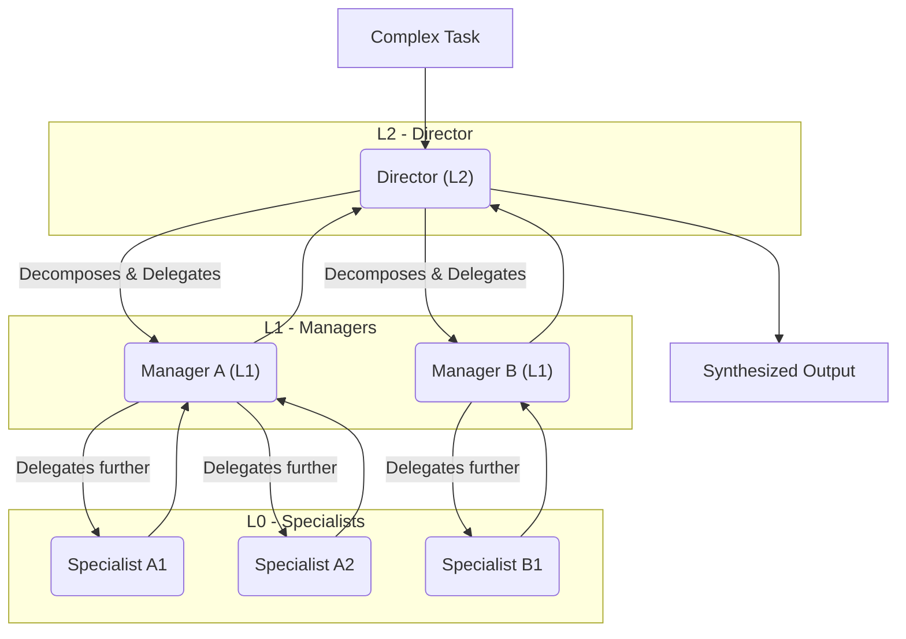

# AgentHive 🐝

[](https://opensource.org/licenses/Apache-2.0)
[](https://www.python.org/downloads/)
[查看中文文档](./README.md)

**AgentHive: A Framework for Hierarchical Multi-Agent Collaboration, Built for Complex Tasks.**

When a single agent hits a wall, AgentHive lets you build, orchestrate, and scale a dynamic team of AI agents that work together in an organized, hierarchical structure.

---

## 🌟 Core Vision: The Tree of Agents (ToA)

AgentHive's core philosophy is **organization conquers complexity**. Instead of creating a single, monolithic "super-agent," we build a structured, predictable, and hierarchical team of specialists.

This team takes the form of a **Tree of Agents (ToA)**:

*   **The Root**: A high-level agent receives the initial, complex task.
*   **The Branches**: It decomposes the task and dynamically creates "sub-agents" or "sub-teams" to handle more specific sub-tasks.
*   **The Leaves**: The lowest-level agents are executors, focused on solving a single, well-defined problem.

This process can be infinitely recursive, forming an organizational structure whose depth and breadth are defined at **runtime** by the task itself.



## 💡 How Does AgentHive Work?

The magic comes from a few simple, core components:

1.  **`BaseAgent` (The Agent)**: The fundamental worker unit. An LLM-powered decision-maker that thinks, selects tools, and executes.
2.  **`ExecutableTool` (The Tool)**: A specific capability an agent possesses, like `web_search` or `add_item`.
3.  **`AgentConfig` (The Blueprint)**: A static configuration that defines an agent's role (System Prompt) and its set of available tools.
4.  **`AssistantToolConfig` (The Delegator Tool)**: **This is the key to the hierarchy.** It's a special "tool" that contains another `AgentConfig`. When a parent agent uses this "tool," it actually creates and starts a brand new sub-agent from the blueprint, delegating a sub-task to it.

**An agent becomes a manager by using a "Delegator Tool."** This is how the Tree of Agents grows.

## ✨ Key Features

*   **Dynamic Team Formation**: The collaborative structure is generated on-the-fly at runtime, not hardcoded.
*   **Hierarchical Task Decomposition**: Recursively break down any complex problem into simple, executable sub-tasks.
*   **Parallel Execution**: Run multiple sub-agents concurrently to process sub-tasks in parallel, dramatically increasing efficiency.
*   **Scoped Context & Permissions**: Task information and permissions flow down the tree, keeping agents focused, secure, and efficient.
*   **Highly Extensible**: Easily define new agent roles and tools and seamlessly integrate them into existing workflows.
*   **Open-Ended Exploration**: The architecture excels at open-ended exploration tasks that lack a predefined solution, thanks to its recursive task decomposition.

## 🚀 Showcase: What Can AgentHive Do?

1.  **`deepresearch` - The Automated Deep Research Analyst**
    *   **Vision**: Transform a vague research topic (e.g., "analyze the problem of LLM hallucinations") into a fully-formed, well-structured, and well-argued research paper.
    *   **Workflow**: The top-level agent generates an outline, then dynamically creates an "Assistant Researcher" sub-agent for each chapter to perform parallel data collection, analysis, and writing. The top-level agent then orchestrates the synthesis of all findings into a final report.

2.  **`firmhive` - The Virtual Binary Security Team**
    *   **Vision**: Simulate a team of cybersecurity experts to conduct a thorough security audit of a firmware or binary file.
    *   **Workflow**: A "Senior Researcher" handles overall planning, a "Binary Analysis Expert" uses professional tools like `radare2` for reverse engineering, and a "Code Auditor" focuses on code-level vulnerabilities. They share findings to produce a comprehensive security assessment.

3.  **`websearch` - The Web-Surfing Information Integrator**
    *   **Vision**: Accomplish tasks that require complex interactions with websites (clicking, typing, scrolling) and integrating information from multiple pages.
    *   **Workflow**: A "Browser Agent" uses both visual information (screenshots) and the DOM structure to understand and interact with pages. It can open multiple tabs in parallel to gather and synthesize information from various sources, just like a human.

## ⚡ Quick Start

1.  **Clone and Install**:
    ```bash
    git clone https://github.com/z-zsstar/AgentHive.git
    cd AgentHive
    ```

2.  **Run an Example (e.g., Deep Research)**:
    Enter the interactive mode:
    ```bash
    python -m examples.deepresearch.main
    ```
    Inside the interactive shell, run the research task:
    ```bash
    run Please write a deep academic paper on "Multi-Agent Collaboration of Large Language Models (LLMs)".
    ```
    The agent team will begin working, and you can see the final report in `output/final_report.md`.

## 📂 Examples Showcase

You can find more examples of final reports generated by AgentHive in the following directories:

*   **Deep Research Reports**: [`examples/deepresearch/examples`](./examples/deepresearch/examples)
*   **Firmware Security Audits**: [`examples/firmhive/samples`](./examples/firmhive/samples)
*   **Binary Analysis Findings**: [`examples/binhive/samples`](./examples/binhive/samples)

## 🤝 Contributing

We warmly welcome contributions of all kinds! Whether it's fixing a bug, developing a new feature, or improving the documentation, your help is crucial. Please feel free to open an Issue or a Pull Request.

## 📄 License

This project is licensed under the [Apache License 2.0](LICENSE).
